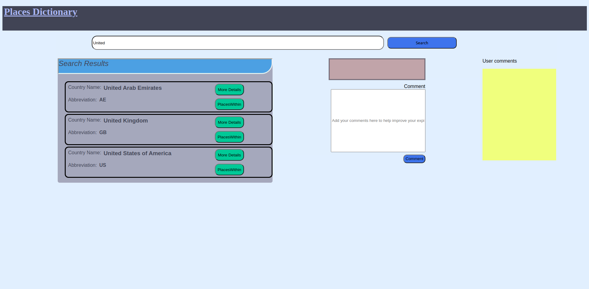
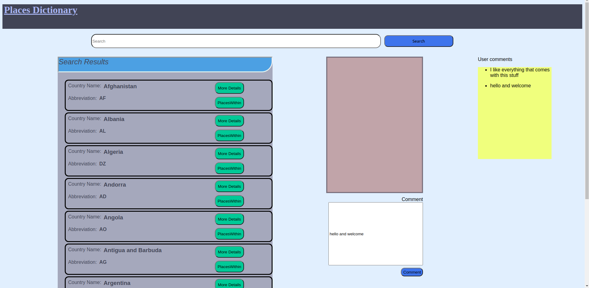

# Places Dictionary
----------
#### Capstone Project
----------

### Table of contents
1. [Description](#project-description)
2. [Installation Requirements](#installation-guide)
3. [Technology Used](#technologies-used)
4. [License](#License)
5. [Authors Info](#AuthorInfo)
----------
## Project Description
----------
As a means of exploration. This web app allows users to search for different countries and get information on the cities as well as the country itself.

### User Operations
- At first glance the user receives countries in a alpahabetical order.
- A user may type the in the country from the search box.
- To get more information on countries a user may opt to click the  More details button.
- To get details on areas within the country a user may opt to click on the PlacesWithin button
- A User may add comments on how to improve their user expirience

##### Features
Show list of countries

----------
Search Country

----------

Country with details

----------
Country with city details

----------

Comments and Display

----------

## Installation guide
clone this repo via https or ssh
- https://github.com/Mjomba60/Places-Dictionary.git
- git@github.com:Mjomba60/Places-Dictionary.git
You might want to run `npm install` to get the local database running to begin working with the comments section
----------

## Technologies Used
- Html
- CSS
- JavaScript
----------
## LiveSite
[Place Dictionary](https://mjomba60.github.io/Places-Dictionary/)
----------
## Author
[George Samuel](https://www.linkedin.com/in/george-samuel-504125222)

   

